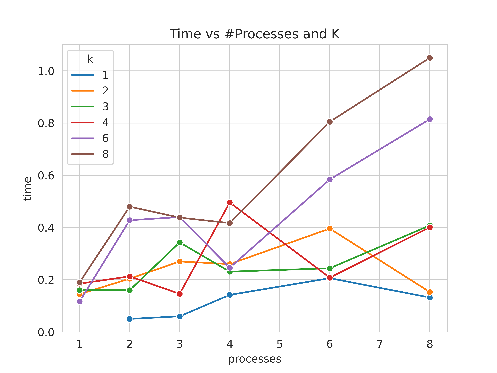
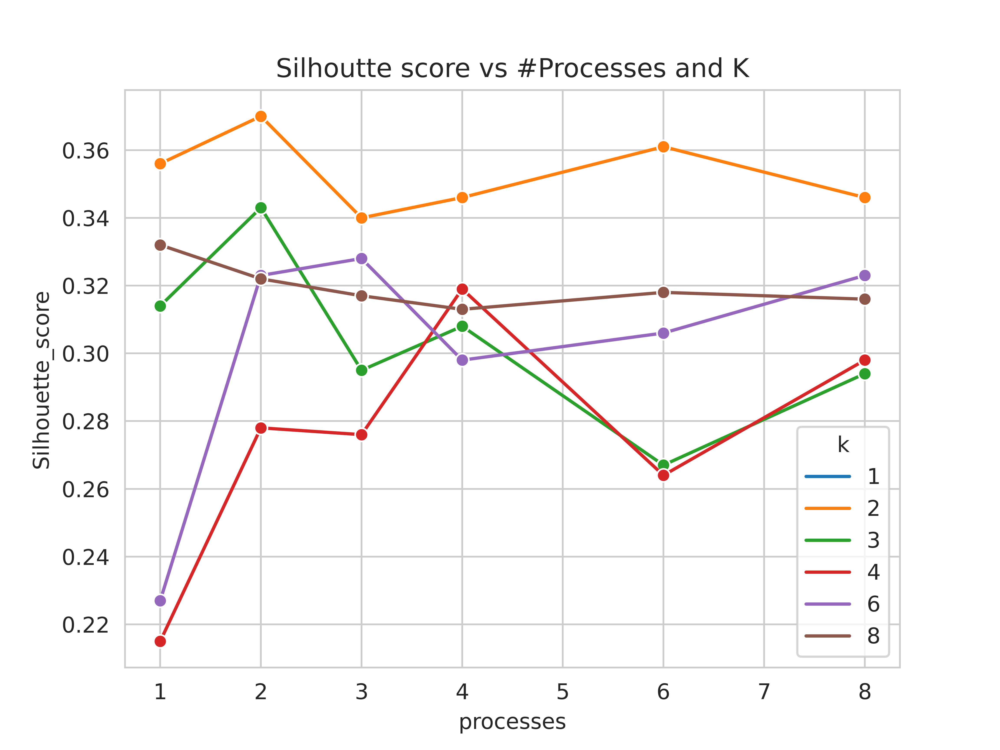

##### Explanation of Distributed K-means clustering

1. Global parameters are ```k``` i.e. ```number of clusters``` and ```prev_distance``` which stores the displacement between old and new centroids.
2. Read CSV data into a ```DataFrame``` called ```df``` and slice the dataframe equally according to the number of workers - ```size```.
3. Randomly sample ```k``` data points from ```df```.
4. Declare a variable ```converging_cond``` which is initially ```False```. It is set to ```True``` when location of centroids stops changing.
5. Scatter sliced dataframes and broadcast ```centroids``` and ```converging_cond```.
6. Repeat until ```converging_cond``` is False:
 - **Parallelization** Compute distance matrix, find minimum distance and update centroids locally. ```compute_update()``` function performs the task
and returns updated centroids. 

 - ```worker 0``` collects local centroids of all workers. It initializes a dataframe ```new_centroids``` of size(k,no_features) with random float values.
 - Then, for each centroid, average of centroids from all workers is calculated. If no point is assigned to a cluster i.e. the mean of a centroid comes ```None```, then it is replaced with a 
   random point from the dataset.
 - Then, we find Euclidean distance between ```new_centroids``` and ```centroids```.
 - Now we check whether our clustering algorithm has converged or not.
 - **Convergence Criteria** - Distance between ```new_centroids``` and old centroids stored in ```centroids``` is calculated and stored in
```distance``` variable. ```pre_distance``` stores this distance from previous iteration. It is initialized with zeros in global params.
   For each centroid, we check how much was the change in this distance from previous iteration. I use ```heuristic_change = 1```, as it is a very minute displacement in this dataset.
   If for every centroid, this difference is less than 1, then ```converging_cond``` is set to ```True```. Hence, clustering algorithm
   converges. Code snippet for convergence:
   
```
   # Finding displacement of new_centroids with respect to previous centroids
        distance = euclidean_distances(new_centroids, centroids)

        # The code for convergence criteria
        update_quantities = [distance[clus][clus]-prev_distance[clus][clus] for clus in range(0,k)]
        prev_distance = distance # Store the previous distance

        ## Heuristic, 1 is a minute displacement in this dataset
        heuristic_change = 1
        check = [i for i in update_quantities if i >= heuristic_change]
        if len(check) == 0:
            converging_cond = True

```
 - If convergence is not yet achieved, then the next iteration continues with the updated centroids.
 7. Finally, to find the **goodness of clusters**, **Silhouette score** is used. It measures the similarity to its own cluster and dissimilarity from other clusters.

#### Performance Analysis for different number of workers and clusters

##### Algorithm Analysis for k=1

|   |  time| Silhouette score  |  |   |
|---|---|---|---|---|
| P=1 | NA  | NA | 
| P=2 | 0.05 | NA |   
| P=3 | 0.06 | NA |  
| P=4 | 0.142 |  NA |  
| P=6 | 0.206 |NA |   
| P=8 | 0.132 | NA |

##### Algorithm Analysis for k=2

|   |  time| Silhouette score  |  |   |
|---|---|---|---|---|
| P=1 | 0.145  | 0.356 |
| P=2 | 0.204 | 0.370 |
| P=3 | 0.27 | 0.340 |
| P=4 | 0.26 |  0.346 |
| P=6 | 0.396 |0.361 |
| P=8 | 0.153 | 0.346 |


##### Algorithm Analysis for k=3

|   |  time| Silhouette score  |  |   |
|---|---|---|---|---|
| P=1 | 0.160  | 0.314 |
| P=2 | 0.160 | 0.343 |
| P=3 | 0.343 | 0.295 |
| P=4 | 0.231 |  0.308 |
| P=6 | 0.244 |0.267 |
| P=8 | 0.408 | 0.294 |


##### Algorithm Analysis for k=4

|   |  time| Silhouette score  |  |   |
|---|---|---|---|---|
| P=1 | 0.185  | 0.215 |
| P=2 | 0.213 | 0.278 |
| P=3 | 0.146 | 0.276 |
| P=4 | 0.496 | 0.319 |
| P=6 | 0.208 | 0.264 |
| P=8 | 0.401 | 0.298 |

##### Algorithm Analysis for k=6

|   |  time| Silhouette score  |  |   |
|---|---|---|---|---|
| P=1 | 0.117  | 0.227 |
| P=2 | 0.428 | 0.323 |
| P=3 | 0.44 | 0.328 |
| P=4 | 0.246 | 0.298 |
| P=6 | 0.584 | 0.306 |
| P=8 | 0.815 | 0.323 |

##### Algorithm Analysis for k=8

|   |  time| Silhouette score  |  |   |
|---|---|---|---|---|
| P=1 | 0.190  | 0.332 |
| P=2 | 0.480 | 0.322 |
| P=3 | 0.438 | 0.317 |
| P=4 | 0.417 | 0.313 |
| P=6 | 0.805 | 0.318 |
| P=8 | 1.05 | 0.316 |  

##### Line plots 






##### Explanation of Parallel Stochastic Gradient Descent

- Training dataset is divided among all the workers.
- After each worker completes its training, master node collects paramters (weights and biases) from each worker and computer their average. 
- Test accuracy is calculated on the final model.
- The experiment is performed for different number of workers.


- Arguments:(batch_size=64,   cuda=False,   epochs=7,   lr=0.001,test_batch_size=64)
- total Training images: 40,000 (MNIST dataset)


